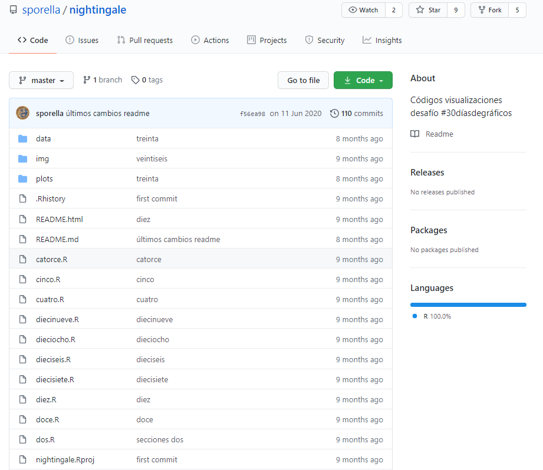
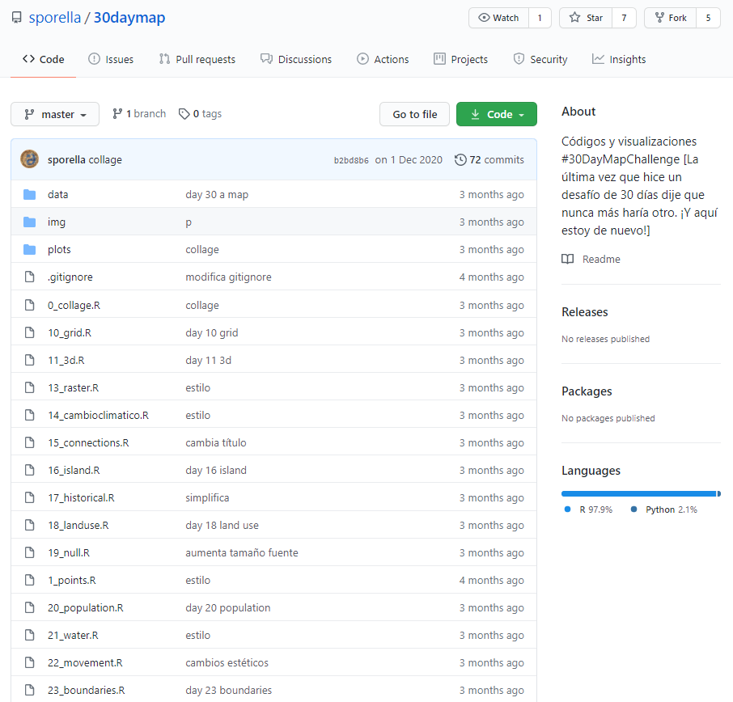

```{r setup, include=FALSE}
options(htmltools.dir.version = FALSE)
```

```{r xaringan-themer, include=FALSE, warning=FALSE}
library(xaringanthemer)


extra_css <- list(
  ".title-slide h1" = list("color" = "#413c69", "font-size" = "5rem"),
  ".title-slide h2" = list("color" = "#726a95"),
  ".inverse h3" = list("color" = "#1687a7"),
  ".inverse h1" = list("color" = "#1687a7"),
  ".purple_h1" = list("color" = "#944db3", "font-size" = "4rem"),
  ".black_color" = list("color" = "#413c69")
)

style_duo_accent(
  primary_color = "#b5f7de",
  secondary_color = "#FFFFFF", 
  white_color = "#dad9fc",
  inverse_header_color = "#944db3",
  link_color = "#bf4392",
  header_h1_font_size = "4rem",
  header_h2_font_size = "1.5rem", 
  header_color = "#944db3",
  title_slide_text_color = "#413c69",
  code_inline_color = "#48b59a", text_slide_number_color = "#7c807f",
  header_font_google = google_font("Space Mono", "400"),
  text_font_google   = google_font("Space Mono", "400"),
  code_font_google   = google_font("IBM Plex Mono"),
  extra_css = extra_css

)

```

class: inverse

.purple_h1[Malos Nombres]

.pull-left[
`Introducción final dic doc.pdf` 

`modelo.xlsx` 

`figura I.png` 
]

--

.pull-left[
`Introducción final dic doc-2.pdf` 

`Datos contacto@gatos.cl.txt` 

`W.docx` 
]
--

.purple_h1[¿Cómo escribir buenos nombres?]


---
class: middle 
# Tres principios `r emo::ji("three")`


--


## Leíbles para el computador

--

## Leíbles para los humanos

--

## Funcionen bien con orden por defecto


---
class: middle

# Para el computador `r emo::ji("computer")`

--

- Expresiones regulares y palabras clave
  - Sin caracteres especiales
  - Sin signos de puntuación

--

- Fácil de programar
  - Uso deliberado de los separadores (permite extraer metadatos desde el nombre de los archivos)
  - Usar "_" para separar metadatos
  - Usar "-" para separar nombres con más de una palabra
  
---
class: inverse
# Para el computador `r emo::ji("computer")`

--
- Es más fácil para buscar archivos más tarde

--
- Es más fácil seleccionar grupos más pequeños a partir de los nombres

--
- Facilita el extraer información desde los nombres de los archivos

--
- Evitar: `r emo::ji("skull_and_crossbones")`
  - espacios en los nombres de los archivos
  - signos de puntuación
  - caracteres acentuados
  - diferentes archivos llamados "gato" y "Gato"

---
class: middle
# Para humanos `r emo::ji("woman")` `r emo::ji("man")`

--
- Fácil de saber qué es lo que contiene el archivo a partir de su nombre

--
- Usar "slug" (parte del nombre que identifica de qué se trata)

---
class: inverse

.purple_h1[¿Cuál prefieres si son las 2:45 AM?`r emo::ji("scream")`]

.pull-left[

01.docx

02.docx

03.docx

04.docx

05.docx

06.docx

nada.docx
]

.pull-right[

01_introduccion.docx

02_materiales-metodos.docx

03_discusion.docx

04_conclusion.docx

05_bibliografia.docx

06_modelos-y-tablas.docx

07_sobras-modelos-y-textos.docx
]
---
class: inverse

```{r , echo = F, out.width="80%", fig.align='center'}

```

---
class: middle
# Fácil de ordenar `r emo::ji("open_file_folder")`

- Fácil de ordenar por defecto:

--

  - Usar algo numérico al principio

--

  - Usar fechas en formato "ISO 8601" (YYYY-MM-DD)

--

  - Anteponer ceros  


---

class: inverse

```{r , echo = F, out.width="80%", fig.align='center'}

```

---
class: middle

# Comentarios finales

--
- Sé considerada contigo misma

--
-  Fácil de implementar AHORA

--

- La práctica mejora los resultados (sobre todo con proyectos complejos)

--
- ¡Vamos a usar nombres increíbles! `r emo::ji("flexed_biceps_medium_light_skin_tone")`
